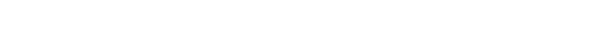
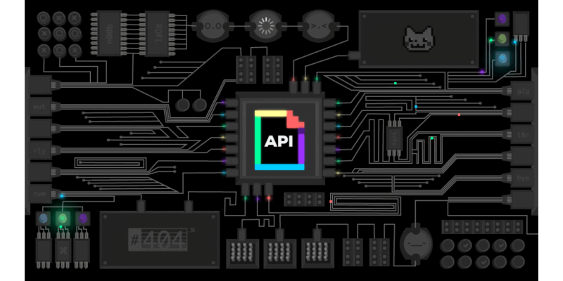

  <!-- BRAND HEADER -->
  <a href="https://github.com/kishikuun">
    <picture>
      <source media="(prefers-color-scheme: dark)" srcset="assets/wordmark-dark.svg">
      
    </picture>
  </a>

    

  <!-- HERO MATRIX RAIN & IDENTITY -->
  

   

  <!-- SECURITY PLATFORM BADGES -->
  

    
    
    
    
    
  

   

  <!-- MATRIX COMMAND PROMPT TYPING -->
  

    

  <!-- MONOCHROME MATRIX BADGES -->
  
  &nbsp;
  
  &nbsp;
  

    

  

 

## 💫 WHO AM I ?

> *"The best way to predict the future is not to wait for it, but to architect it from the bare metal up."*

Hey, I'm **Phan Anh Khoa (kishikuun)**, a high school student and tech enthusiast based in Vietnam.

I am deeply passionate about **IoT, AIoT, AI, and Fullstack Development**, but my biggest passion lies in **Cyber Security, Pentesting, and Redteaming**. I balance rigorous algorithmic thinking with a hacker's mindset to dissect systems and build robust solutions.

* **The Hacker's Mindset:** I love exploring vulnerabilities, chasing CVEs, and understanding operating system internals from a Redteam perspective.
* **Fullstack Craftsmanship:** From building scalable web applications to tinkering with hardware (IoT), I believe in creating secure and resilient architectures.

 

## 🌐 Socials & Contact

## 💻 Tech Stack & Capabilities

### 🛡️ Cyber Security & Redteam

 

### 🌐 MERN Stack & Fullstack Development

  
  
  
  
  

### ☕ Core Languages & Ecosystem

   
   
  
   
   

## 🧩 Coding Profiles

  
  
  

## ⚙️ LOADED MODULES

<table width="100%">
  <tr>
    <td width="18%" valign="middle"><strong>AGENTIC & AI</strong></td>
    <td width="82%" valign="middle">
      
      
      
    </td>
  </tr>
  <tr>
    <td width="18%" valign="middle"><strong>ARCHITECTURE</strong></td>
    <td width="82%" valign="middle">
      
      
      
    </td>
  </tr>
  <tr>
    <td width="18%" valign="middle"><strong>SECURITY</strong></td>
    <td width="82%" valign="middle">
      
      
      
    </td>
  </tr>
</table>

## 📊 Telemetry & Stats

  

  
  

  
  

 

## ⚡ Contribution Animations

  <picture>
    <source media="(prefers-color-scheme: dark)" srcset="https://raw.githubusercontent.com/hoangtien2k3/hoangtien2k3/output/pacman-contribution-graph-dark.svg">
    <source media="(prefers-color-scheme: light)" srcset="https://raw.githubusercontent.com/hoangtien2k3/hoangtien2k3/output/pacman-contribution-graph.svg">
    
  </picture>

 

  <picture>
    <source media="(prefers-color-scheme: dark)" srcset="./dist/github-snake-dark.svg">
    <source media="(prefers-color-scheme: light)" srcset="./dist/github-snake.svg">
    
  </picture>

 

  

 

  
    Engineered by <strong>kishikuun</strong>
  

