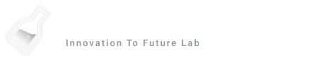

  <!-- BRAND HEADER -->
  

    

  <!-- 1. HERO MATRIX RAIN & IDENTITY -->
  

   

  <!-- 2. BIO & IDENTITY DESCRIPTION -->
  

    <strong>Systems Architect & Developer</strong> 
    Engineering autonomous systems, data-driven insights, and algorithmic solutions.
  

   

  <!-- 3. MATRIX COMMAND PROMPT TYPING -->
  

    

  <!-- 3. MONOCHROME MATRIX BADGES -->
  
  &nbsp;
  
  &nbsp;
  
  &nbsp;
  

    

  

 

## 💫 WHO AM I ?

> *"The best way to predict the future is not to wait for it, but to architect it from the bare metal up."*

Hey, I'm **Kishikuun**, a tech-driven student and developer based in Vietnam.

Fascinated by the architecture of computation and data-driven insights, I am passionate about designing algorithmic solutions to real-world challenges. I balance rigorous mathematical thinking with strong global communication skills.

* **The Explorer's Mindset:** I don't just build applications; I love dissecting operating system internals, experimenting with new models, and pushing the envelope of technology.
* **Architectural Craftsmanship:** I believe in building systems that are sovereign, resilient, and crafted with obsessive precision.

 

## 🌐 Socials & Contact

## 💻 Tech Stack

   
   
   
   
   
   
   

## ACTIVE PROCESSES

<table>
  <tr>
    <td width="50%" valign="top">
      
<strong><a href="https://github.com/kishikuun/Project-A">PROJECT A</a></strong> &nbsp; <code>[PID: 0x01 // KERNEL]</code>

      
Sovereign AI Multi-Agent Operating System

      

        Autonomous intelligence kernel for the desktop. Integrates neural dynamics for reactive cognition.
      

      

        
        
        
      

    </td>
    <td width="50%" valign="top">
      
<strong><a href="https://github.com/kishikuun/Project-B">PROJECT B</a></strong> &nbsp; <code>[PID: 0x02 // MESH]</code>

      
Decentralized P2P Mesh and State Sync Layer

      

        Distributed infrastructure connecting autonomous local agent nodes through secure cloud tunneling.
      

      

        
        
        
      

    </td>
  </tr>
</table>

## LOADED MODULES

<table width="100%">
  <tr>
    <td width="18%" valign="middle"><strong>AGENTIC</strong></td>
    <td width="82%" valign="middle">
      
      
      
      
    </td>
  </tr>
  <tr>
    <td width="18%" valign="middle"><strong>ARCHITECTURE</strong></td>
    <td width="82%" valign="middle">
      
      
      
      
    </td>
  </tr>
  <tr>
    <td width="18%" valign="middle"><strong>SECURITY</strong></td>
    <td width="82%" valign="middle">
      
      
      
    </td>
  </tr>
  <tr>
    <td width="18%" valign="middle"><strong>BACKEND</strong></td>
    <td width="82%" valign="middle">
      
      
      
      
    </td>
  </tr>
</table>

  

 

## 📊 GitHub Stats

  
    
  

 

## ⚡ Contribution Animations

  <picture>
    <source media="(prefers-color-scheme: dark)" srcset="https://raw.githubusercontent.com/hoangtien2k3/hoangtien2k3/output/pacman-contribution-graph-dark.svg">
    <source media="(prefers-color-scheme: light)" srcset="https://raw.githubusercontent.com/hoangtien2k3/hoangtien2k3/output/pacman-contribution-graph.svg">
    
  </picture>

 

  <picture>
    <source media="(prefers-color-scheme: dark)" srcset="./dist/github-snake-dark.svg">
    <source media="(prefers-color-scheme: light)" srcset="./dist/github-snake.svg">
    
  </picture>

 

  
    Engineered by <strong>Kishikuun</strong>
  

